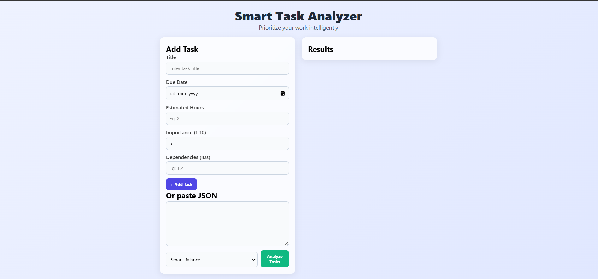
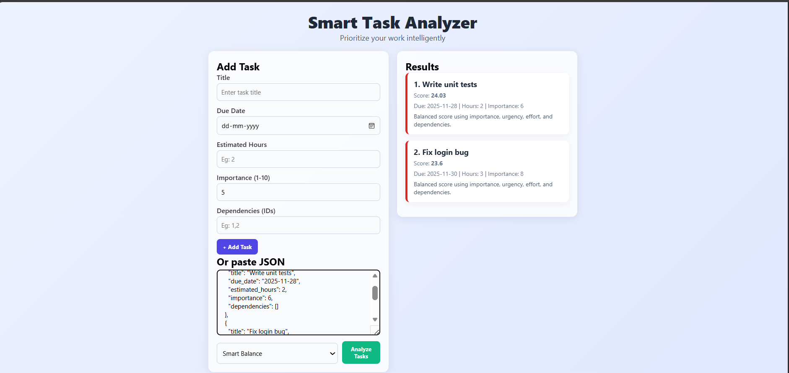
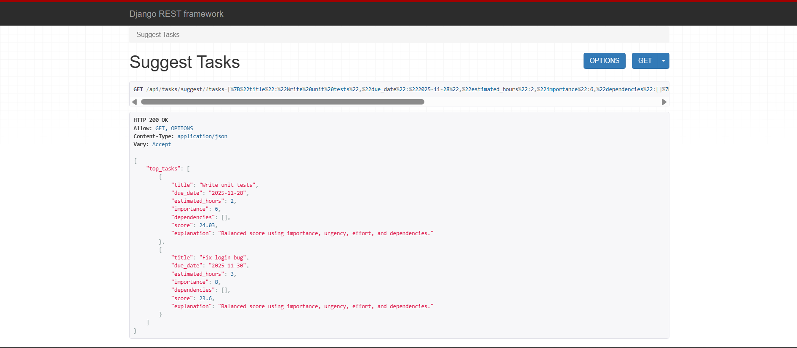

⚡ Smart Task Analyzer

A mini full-stack application that intelligently scores and prioritizes tasks based on urgency, importance, effort, and dependencies.

This assignment is developed for Singularium Technologies - Software Development Intern Assessment (2025).

🚀 Features
🔢 Intelligent Task Scoring

The app calculates a priority score using multiple factors:

Urgency (based on due date)

Importance (1–10 scale)

Effort (estimated hours)

Dependency count

Overdue task boosting

🧠 Four Scoring Modes

Smart Balance (default) — Considers all factors

Fastest Wins — Low-effort tasks first

High Impact — Importance-first strategy

Deadline Driven — Urgent tasks prioritized

💡 API Endpoints

✔ POST /api/tasks/analyze/
Accepts an array of tasks → returns sorted tasks with score + explanation.

✔ GET /api/tasks/suggest/
Returns top 3 tasks to work on today.

🌐 Clean, Modern Frontend

Built using HTML + CSS + JavaScript with:

Glass-effect UI

Priority colors

Animated results

JSON input support

Mode selection dropdown

🏗 Project Structure
task-analyzer/
│
├── backend/
│   ├── task_analyzer/        # Django project
│   ├── tasks/                # App: models, views, scoring, tests
│   ├── requirements.txt
│   └── manage.py
│
├── frontend/
│   ├── index.html
│   ├── styles.css
│   ├── script.js
│   └── screenshots/
│
└── README.md

⚙️ Backend Setup (Windows)
cd backend
python -m venv venv
venv\Scripts\activate
pip install -r requirements.txt
python manage.py migrate
python manage.py runserver

API will run at:

http://127.0.0.1:8000/

🧠 Algorithm Explanation (Smart Mode)

The Smart Balance mode uses a weighted formula:

score =
 (importance * 1.5) +
 (urgency * 1.3) +
 (10 / (effort + 1)) +
 (dependency_count * 2)

⭐ Urgency

Tasks due today → highest urgency

Overdue tasks receive extra weight

Future due dates gradually lower urgency

⭐ Importance

Direct influence from scale 1–10.

⭐ Effort

Lower hours → a "quick win", so increases score.

⭐ Dependencies

Tasks blocking others get a higher priority.

🔍 API Usage
POST /api/tasks/analyze/
Request body:
{
  "mode": "smart",
  "tasks": [
    {
      "title": "Fix login bug",
      "due_date": "2025-11-30",
      "estimated_hours": 3,
      "importance": 8,
      "dependencies": []
    }
  ]
}

Response:

Sorted tasks

Score

Explanation

GET /api/tasks/suggest/
/api/tasks/suggest/?tasks=[{...},{...}]

Returns top 3 tasks with best scores.

🧪 Unit Tests

3 tests included (backend/tasks/tests.py):

Overdue task scoring

Fastest mode scoring

Impact vs Smart comparison

Run tests:

python manage.py test

All tests pass.

🎨 Frontend Features

Add task via form

Paste JSON input

Select scoring mode

Click “Analyze Tasks” → see results

Priority color badges

Smooth UI animations

Responsive layout

📸 Screenshots

rontend Interface

Results After Analysis

API Working in Django REST Framework

📬 Submission

Repository Link:
(Add your GitHub link here before submitting)